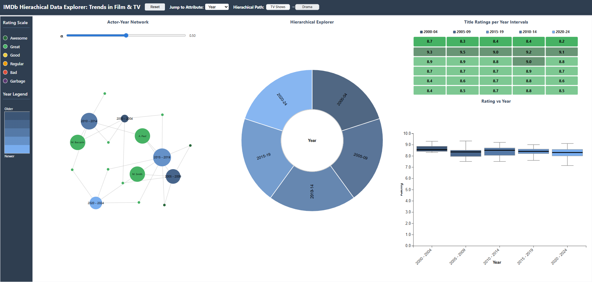

# IMDb Hierarchical Data Explorer

An interactive, multi-view dashboard for exploring trends in film and TV 
using IMDb data. Built with D3.js and vanilla JavaScript during an exchange 
semester at Instituto Superior Técnico (IST), Lisbon.

## Features

**Coordinated views** — all four visualizations update in sync when you 
filter or drill down.

- **Actor–Attribute Network** — force-directed graph linking top actors to 
  attributes (genre, year, type). Node size reflects number of titles; color 
  reflects average rating. An α slider lets you tune whether actors are ranked 
  by rating quality or volume of work.
- **Hierarchical Explorer** — sunburst/donut chart for drilling down through 
  the data hierarchy (e.g. TV Shows → Drama → 2015–19).
- **Title Ratings Heatmap** — cross-tabulation of top-rated titles across 
  time intervals, color-coded by rating.
- **Rating Distribution** — box plots showing rating spread per time period.

## Interactions

- Click any attribute node to drill down into that category
- Click an actor node to highlight their connections across the network
- Use the α slider to rebalance the actor selection scoring
- Click **Reset** in the header to return to the top-level view

## Tech Stack

- [D3.js v7](https://d3js.org/) — all visualizations
- Vanilla JavaScript (ES Modules) — no framework
- HTML5 / CSS3

## Data

Static dataset derived from [IMDb's public data files](https://developer.imdb.com/non-commercial-datasets/). 
Covers titles and cast from 2000–2024 across movies and TV shows.

